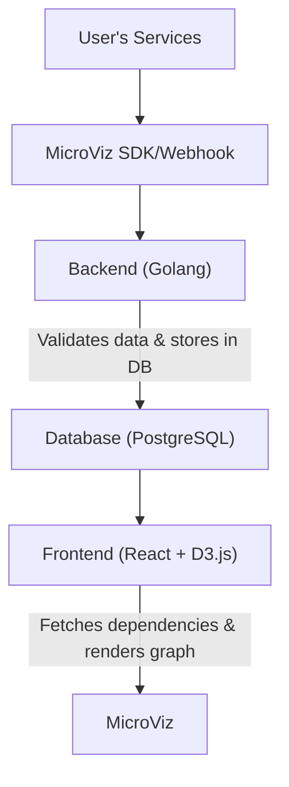

```mermaid
graph TD
    A["User's Services"] --> B["MicroViz SDK/Webhook"]
    B --> C["Backend (Golang)"]
    C -->|Validates data & stores in DB| D["Database (PostgreSQL)"]
    D --> E["Frontend (React + D3.js)"]
    E -->|Fetches dependencies & renders graph| F["MicroViz"]
```
